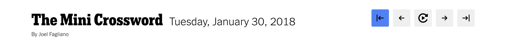

# NYT Mini Crossword Navigator

  

This is a small Google Chrome extension for quickly navigating the NYT Mini Crossword archives. It has 5 functions which are embedded on the Mini Crossword page (described from left to right):

  

- Auto Previous: toggle automatic navigation to the previous day's puzzle upon completion
- Previous: manually navigate to the previous day's puzzle when clicked
- Autoplay: automatically click "Play" on a puzzle when loaded
- Next: manually navigate to the next day's puzzle when clicked
- Auto Next: toggle automatic navigation to the next day's puzzle upon completion
